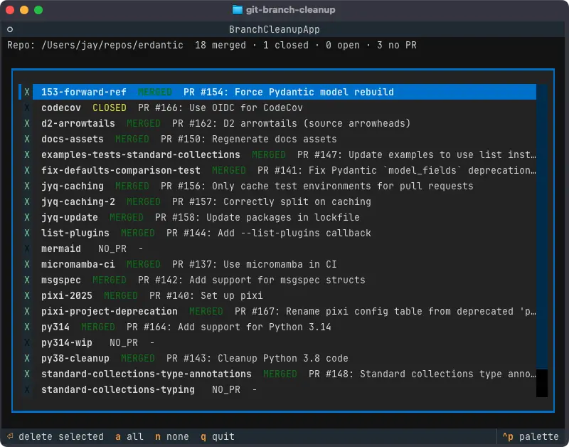

# git-branch-cleanup

**A TUI program for cleaning up old git branches that have been merged on GitHub.**

In addition to checking with git whether a branch's commits are in your default branch, it will also query GitHub for PRs for each branch that have been merged. This allows for the detection of branches that were merged in with a [squash and merge](https://docs.github.com/en/pull-requests/collaborating-with-pull-requests/incorporating-changes-from-a-pull-request/about-pull-request-merges#squash-and-merge-your-commits), which is otherwise not detectable by git alone.



## Usage

### Prerequisite

GitHub's `gh` CLI installed and logged in.

### Usage

This tool is a Python package and can be installed from the repository however you like to install Python packages. I recommend using the [uv](https://docs.astral.sh/uv/) package manager for Python, which makes it really easy.

#### Quick usage with uvx

With your repository as the current working directory, run

```sh
uvx git+https://github.com/jayqi/git-branch-cleanup
```

### Installing with uv tool

Install with

```sh
uv tool install git+https://github.com/jayqi/git-branch-cleanup
```

and then with your repository as the current working directory, run

```sh
git-branch-cleanup
```
